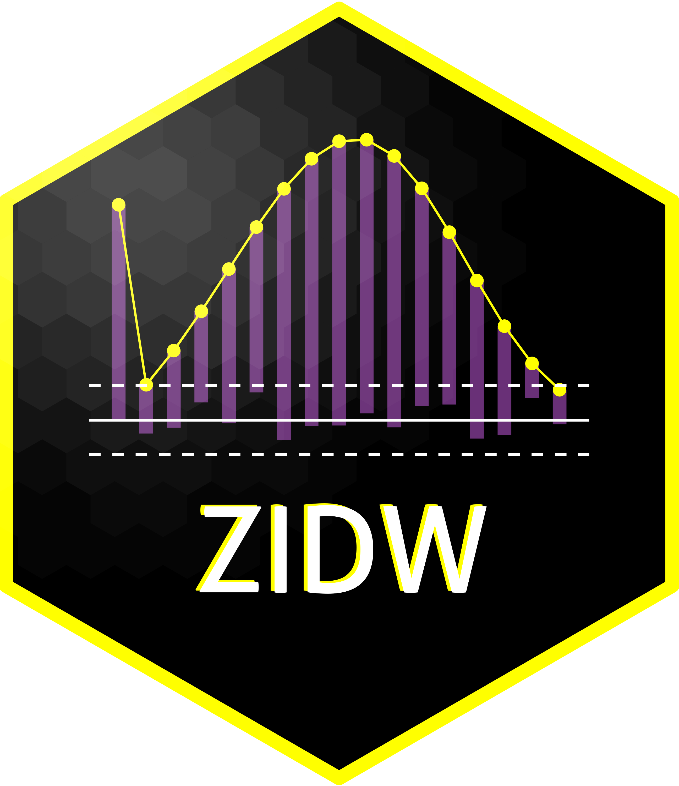

## ZIDW: Tools for Analyzing Zero-Inflated Discrete Weibull Models	<a href='https://github.com/dsy109/ZIDW'></a>

[](https://lifecycle.r-lib.org/articles/stages.html#stable)	
	
[](https://CRAN.R-project.org/package=ZIDW)
[](https://cran.r-project.org/package=ZIDW)

[](https://www.r-pkg.org/pkg/ZIDW)


### Synopsis

The [ZIDW package](https://cran.r-project.org/package=ZIDW) provides functions for analyzing zero-inflated discrete Weibull (ZIDW) models. This package includes parameter estimation for both regression and univariate settings, the distribution functions, functions to generate randomized quantile residuals and a pseudo R2, and plotting of rootograms.

### Documentation

The [help file](https://CRAN.R-project.org/package=ZIDW) documents the references used for each function.

### Examples

Examples for the ZIDW package are included in the help files for various functions.

### Installation

Released and tested versions of ZIDW are available via the
[CRAN](https://cran.r-project.org) network, and can be installed from within R via

```R
install.packages("ZIDW")
```

### Support

The [issue tickets at the GitHub repo](https://github.com/dsy109/ZIDW/issues)
are the primary bug reporting interface.  As with the other web resources,
previous issues can be searched as well.

### Authors

Peng Yeh, Derek S. Young

### License

GPL (>= 2)

### Code of Conduct

As contributors and maintainers of this project, we pledge to respect all people who 
contribute through reporting issues, posting feature requests, updating documentation, 
submitting pull requests or patches, and other activities.  Both contributors and 
maintainers must consistently demonstrate acceptable behavior, respectful communications, 
and professional conduct.  Project maintainers have the right and responsibility to remove, 
edit, or reject comments, commits, code, wiki edits, issues, and other contributions that 
are not aligned to this Code of Conduct.  Project maintainers who do not follow the 
Code of Conduct may be removed from the project team.  Instances of abusive, harassing, 
or otherwise unacceptable behavior may be reported by opening an issue or contacting one 
or more of the project maintainers.  By contributing to this project, you agree to abide 
by its terms.

We are here for a love of coding and a passion for cultivating knowledge.  Let us enjoy 
this collaboration together!
